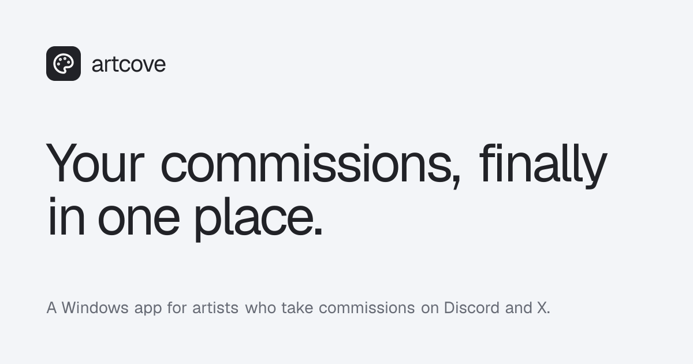

<p align="center">
  <a href="https://artcove.app">
    
  </a>
</p>

<h1 align="center">artcove.app</h1>

<p align="center">
  The website for <a href="https://artcove.app"><strong>artcove</strong></a>, a Windows app for artists who take commissions on Discord and X.
</p>

<p align="center">
  <a href="https://artcove.app"></a>
  <a href="LICENSE"></a>
  
  
</p>

<p align="center">
  <a href="https://artcove.app">
    
  </a>
</p>

## What is artcove?

artcove keeps a commission artist's requests, references, queue, revision notes and invoices in one place, instead of spread across DMs, Trello boards, notes apps and “send it to this PayPal email” messages.

**Download it at [artcove.app](https://artcove.app).**

This repository holds the marketing and download site only. It is fully static and deployed on Vercel.

## Design

The site borrows from how digital artists actually work:

- **Non-photo blue** for structure and progress, like the blue pencil used for underdrawings.
- **Redline** for revisions: the hero sketch gets client notes (“longer ears!”, “eye bags pls”) drawn over it once, on page load.
- **Familjen Grotesk** for text, **Shantell Sans** for the handwritten notes.

## Development

```bash
pnpm install
pnpm dev      # http://localhost:3000
pnpm build
```

Built with Next.js 16 (App Router), React 19, Tailwind CSS 4, `next/og` for the share image and [Lucide](https://lucide.dev) for the logo icon.

### Shipping a new app version

Edit `src/lib/download.ts`:

- `version`: the app version shown on the site, e.g. `"2.5.0"`
- `windowsUrl`: direct link to the installer
- `fileSize`: e.g. `"8.4 MB"`

While `windowsUrl` is empty, every download button points to `/download`.

Social links live in `src/lib/site.ts`; empty ones are hidden.

## License

The website source code is [MIT licensed](LICENSE). The artcove name and logo are not covered by the license.
